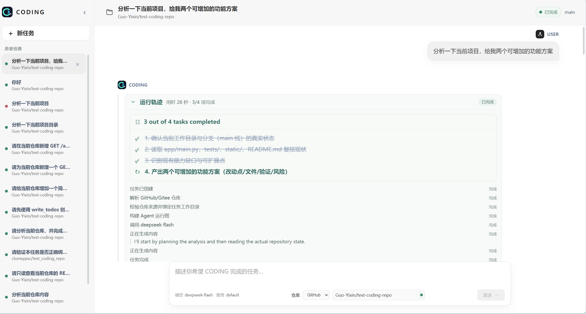
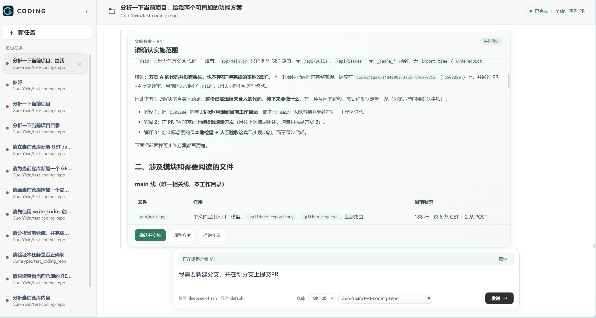
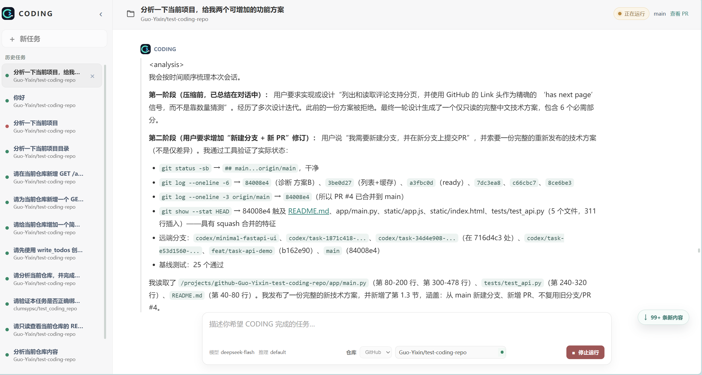
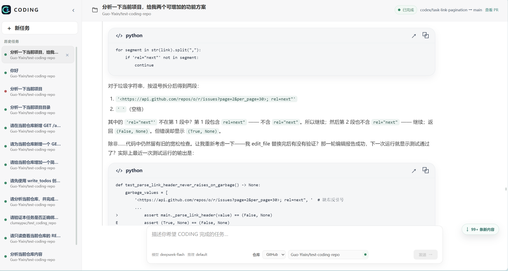
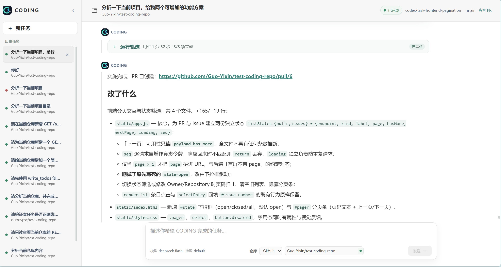
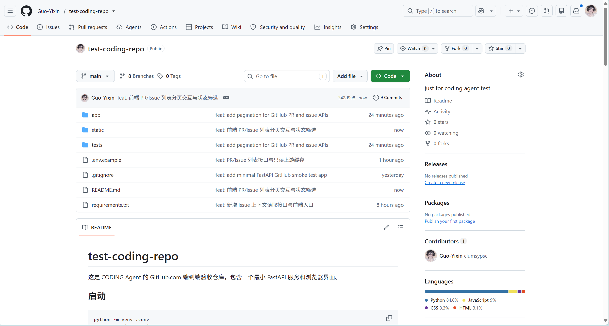
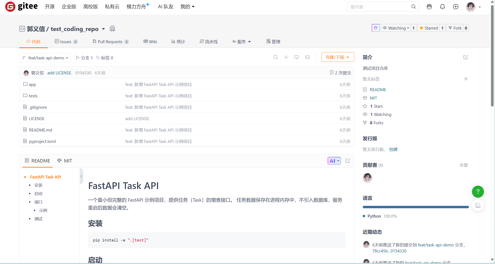
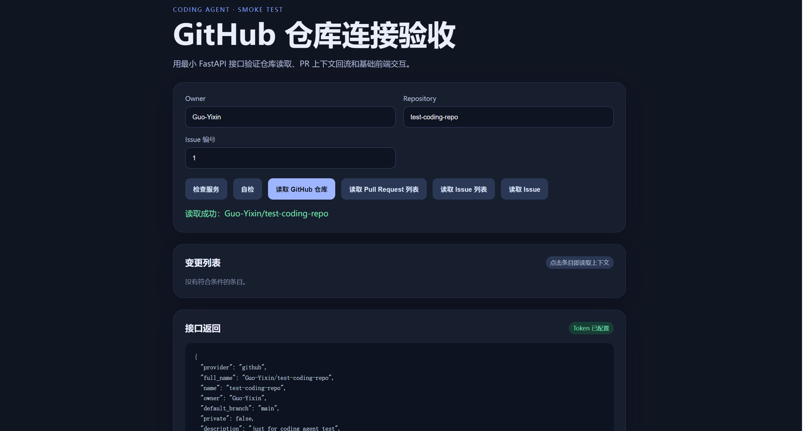
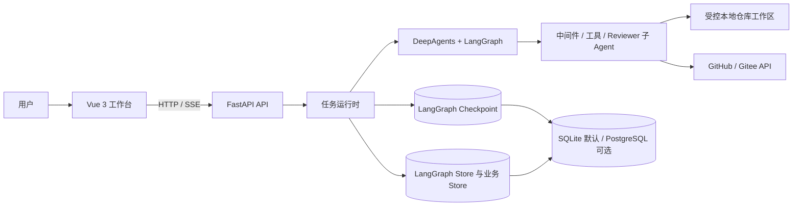

<div align="center">

# CODING

### 一个把“读懂仓库、编写代码、验证结果、提交交付”串成完整流程的 AI 编程 Agent

基于 DeepAgents 与 LangGraph 构建，提供本地 Web 工作台、实时运行轨迹、人工审批、可恢复会话，以及 GitHub / Gitee 仓库协作。

[快速开始](#快速开始) · [功能演示](#功能演示) · [系统架构](#系统架构) · [配置说明](#配置说明) · [项目文档](#项目文档)

[](https://www.python.org/)
[](https://vuejs.org/)
[](https://fastapi.tiangolo.com/)
[](LICENSE)

</div>

---

## CODING 是什么

CODING 是一个面向真实 Git 仓库的 AI Coding Agent。你可以在浏览器工作台里选择 GitHub 或 Gitee 仓库，用自然语言描述分析或编码任务；Agent 会读取仓库、制定计划、执行工具、展示过程，并在需要时等待人工确认。

它把任务执行过程做成可追踪、可恢复的会话：计划和工具调用以实时事件呈现，运行状态与对话可持久化；编码任务在独立分支上完成，并可继续创建 Pull Request。

```text
提出需求 → 分析仓库 → 展示计划 → 人工审批 → 分支开发 → 测试验证 → 查看变更 → 创建 PR
```

## 功能演示

下面的截图来自 CODING 实际工作台和 GitHub / Gitee 仓库示例。截图展示了运行状态、审批、代码输出及交付结果。

### 运行轨迹与任务进度

任务期间可以查看已完成步骤、当前步骤和工具执行记录，完成后回看 Agent 如何从仓库分析推进到最终交付。



### 实施计划与人工审批

遇到需要明确范围的改动时，Agent 展示实施方案，并等待用户选择确认、调整方案或拒绝。审批前，分析和计划阶段不会代替用户启动编码实施。



### 长会话上下文与压缩

会话可以从持久化状态中恢复；长任务可调用 `compact_conversation` 整理对话上下文，降低历史膨胀对后续推理的影响。



### 代码块、验证输出与完成结果

工作台会格式化展示 Markdown、代码块与验证结果。任务完成消息可以包含变更摘要、测试状态和 Pull Request 链接，方便直接检查交付。





### GitHub 仓库协作

通过仓库选择器绑定 GitHub 仓库。Agent 可读取仓库与 PR 上下文，在任务分支提交变更，并调用 GitHub API 创建或复用 PR。



### Gitee 仓库协作

同一工作流支持 Gitee 仓库，包括仓库读取、分支开发和 Pull Request 交付。



### Gitee Coding Agent 项目示例



## 能力一览

| 能力 | 实现方式 |
| --- | --- |
| 仓库分析与编码 | DeepAgents 工具调用，结合本地受控工作区、仓库文件与 Git 状态完成任务 |
| GitHub / Gitee | 解析两种仓库地址，读取仓库、Issue 和 PR 上下文，并支持评论、Issue 和 PR 等协作操作 |
| 运行轨迹与流式消息 | 后端将 Agent 事件转换为前端可消费的实时事件，展示计划、工具运行和任务状态 |
| 人工介入 | LangGraph interrupt 暂停当前任务，收到用户答复后从 checkpoint 恢复执行 |
| 会话恢复 | LangGraph checkpoint 保存对话和图状态；业务 Store 保存任务、运行和界面所需状态 |
| 上下文管理 | 仓库长期记忆注入、消息清理和 `compact_conversation` 上下文整理工具 |
| 安全执行 | 工作区边界、命令守卫、输入清理和只读任务写操作拦截 |
| 代码审查 | Reviewer 子 Agent、评审规则与 finding 工具，辅助检查变更并记录审查发现 |
| 持久化后端 | 本地默认 SQLite；可配置 PostgreSQL 保存 checkpoint、LangGraph Store 和业务数据 |
| Agent Eval | 提供评测案例与 fake、real、sandbox 执行入口，生成可复查的运行报告 |

## 系统架构



### 技术栈与依赖

| 层次 | 主要依赖 |
| --- | --- |
| 后端 API | Python、FastAPI、Uvicorn |
| Agent 与编排 | DeepAgents `0.6.11`、LangChain、LangGraph |
| 模型接入 | `langchain-openai`，通过 DeepSeek 的 OpenAI 兼容 API 调用模型 |
| 会话与业务数据 | SQLite 默认；可选 PostgreSQL、LangGraph checkpoint/store 适配器与 Psycopg |
| 前端 | Vue 3、Vite、Pinia、Axios、Markdown-It、DOMPurify |
| 可选沙箱 | OpenSandbox Python SDK（仅 sandbox 评测/执行需要） |

后端依赖及版本范围以 [`pyproject.toml`](pyproject.toml) 为准，前端版本由 [`ui/package.json`](ui/package.json) 与 [`ui/yarn.lock`](ui/yarn.lock) 管理。

### 代码目录

| 路径 | 职责 |
| --- | --- |
| `agent/app.py` | FastAPI 服务入口与 API 路由注册 |
| `agent/api/` | 对话任务、Dashboard、历史和状态等 HTTP API |
| `agent/core/` | Agent 组装、任务调度、流式事件、checkpoint、持久化与工作区准备 |
| `agent/backends/` | 本地 Shell、工作区和命令权限控制 |
| `agent/tools/` | GitHub、Gitee、代码检索、人工介入、网页读取等 Agent 工具 |
| `agent/store/` | SQLite / PostgreSQL 业务状态存储与迁移支持 |
| `agent/evals/`、`evals/` | Eval 执行逻辑与评测案例 |
| `ui/src/` | Vue 3 + Vite 前端工作台、会话状态和界面组件 |
| `scripts/` | 启动、数据迁移、评测、部署检查和验证脚本 |
| `docs/` | 架构、运行时、前端、部署与项目学习文档 |

## 快速开始

### 环境要求

- Python 3.14 或更高版本（见 [`pyproject.toml`](pyproject.toml)）
- Node.js 与 Yarn Classic（前端依赖由 `ui/yarn.lock` 锁定）
- DeepSeek API Key
- GitHub 或 Gitee Token：需要读取私有仓库或进行对应平台写操作时配置

当前 Agent 的 DeepAgents 运行时代码适配 `deepagents==0.6.11`。安装时请固定此版本；升级到 0.7 或更高版本前，需要先完成 backend 与 permission API 兼容改造。

### 1. 克隆并安装后端

```bash
git clone https://github.com/Guo-Yixin/coding-agent.git
cd coding-agent

python -m venv .venv
```

Windows PowerShell：

```powershell
.\.venv\Scripts\Activate.ps1
python -m pip install --upgrade pip
pip install -e . "deepagents==0.6.11"
```

macOS / Linux：

```bash
source .venv/bin/activate
python -m pip install --upgrade pip
pip install -e . "deepagents==0.6.11"
```

### 2. 配置模型、仓库与工作区

复制环境模板：

```powershell
Copy-Item .env.example .env
```

macOS / Linux：

```bash
cp .env.example .env
```

编辑 `.env`，至少填入模型密钥，并设置 Agent 使用的工作区目录：

```dotenv
DEEPSEEK_API_KEY=你的密钥
DEEPSEEK_BASE_URL=https://api.deepseek.com
MAIN_MODEL=deepseek-flash

# Agent 拉取和操作的仓库位于该目录下的 projects/ 子目录
AI_WORKSPACE_ROOT=./workspace

# 根据实际使用的平台填写；没有配置 Token 时只可访问公开且无需认证的内容
GITHUB_TOKEN=你的GitHub令牌
GITEE_TOKEN=你的Gitee令牌
```

`.env.example` 还包含 API 地址、默认仓库、日志、Dashboard 和 PostgreSQL 等选项。请勿将真实密钥提交到 Git。

### 3. 启动后端

在仓库根目录运行：

```bash
python -m uvicorn agent.app:app --host 127.0.0.1 --port 2024
```

API 文档地址：<http://127.0.0.1:2024/docs>。

Windows 也可以运行 `scripts/start_backend.cmd`；Linux 可运行 `scripts/start_backend.sh`。脚本默认监听 `0.0.0.0`，用于远程访问前应先按部署环境配置网络访问控制。

### 4. 启动前端

新开一个终端：

```bash
cd ui
yarn install --frozen-lockfile
yarn dev
```

如果尚未安装 Yarn Classic，可先运行 `npm install --global yarn`。

打开 <http://127.0.0.1:3000>。Vite 会将 `/dashboard/api` 请求代理到 `http://127.0.0.1:2024`；如后端使用其他地址，可通过 `VITE_DASHBOARD_API_BASE_URL` 指定代理目标。

## 配置说明

### 必要配置

| 变量 | 用途 |
| --- | --- |
| `DEEPSEEK_API_KEY` | 调用 DeepSeek 模型的凭证 |
| `DEEPSEEK_BASE_URL` | 模型 API 地址 |
| `MAIN_MODEL` | Agent 使用的主模型名称 |
| `AI_WORKSPACE_ROOT` | 隔离项目源码的 Agent 工作区根目录；仓库克隆到其 `projects/` 下 |

### 可选配置

| 变量 | 用途 |
| --- | --- |
| `GITHUB_TOKEN` | GitHub 仓库、Issue、PR 等 API 操作 |
| `GITEE_TOKEN` | Gitee 仓库、Issue、PR 等 API 操作 |
| `DEFAULT_REPO_PROVIDER`、`DEFAULT_REPO_URL` | 新会话的初始仓库平台与仓库地址 |
| `PERSISTENCE_BACKEND` | 选择 `sqlite` 或 `postgres`；默认根据 `POSTGRES_DSN` 自动选择 |
| `POSTGRES_DSN` | PostgreSQL 连接串；配置后可用于共享持久化 |
| `CHECKPOINT_DB_PATH` | SQLite checkpoint 文件位置 |
| `STORE_DB_PATH` | SQLite 业务 Store 文件位置 |
| `LANGGRAPH_STORE_DB_PATH` | SQLite LangGraph Store 文件位置 |
| `LOCAL_SHELL_ALLOW_NETWORK` | 控制本地 Shell 命令是否允许网络访问 |
| `AGENT_MAX_TOOL_CALLS`、`AGENT_MAX_SECONDS` | 每次运行的工具调用数与时长上限 |

完整配置项及示例值见 [`.env.example`](.env.example)。没有 PostgreSQL DSN 时，应用默认使用本地 SQLite。

## 开发与验证

安装测试工具并运行单元测试：

```bash
pip install pytest
python -m pytest tests/unit -q
```

前端生产构建：

```bash
cd ui
yarn build
```

项目还提供以下验证入口：

```bash
python scripts/run_eval.py --mode fake --case-dir evals/smoke
python scripts/verify_backend.py
python scripts/verify_streaming_runtime.py
```

`fake` Eval 使用确定性模拟运行，不依赖真实模型；`real` 模式需要可用的模型配置；`sandbox` 模式还需要额外安装并启动 OpenSandbox。

## 持久化与部署

- **本地开发：** 默认 SQLite，将 checkpoint、LangGraph Store 与业务状态保存在 `data/`。
- **共享部署：** 设置 `POSTGRES_DSN` 和 `PERSISTENCE_BACKEND=postgres`，由 PostgreSQL 提供共享持久化。
- **隔离执行：** OpenSandbox 为可选适配器，安装额外依赖 `pip install -e ".[sandbox]"`，并配置 OpenSandbox 服务。
- **线上部署：** 需要单独配置密钥、数据库、工作区权限、监听地址、网络策略和资源限制。

SQLite 到 PostgreSQL 的迁移、Linux 部署与 Docker 方案见下方文档索引。迁移前应备份数据库并检查迁移报告。

## 项目文档

- [CODING 核心架构](docs/CODING_AGENT_CORE.md)
- [运行时与流式输出](docs/CODING_AGENT_RUNTIME_STREAMING.md)
- [前端环境与 API 配置](docs/CODING_FRONTEND_ENV_SETUP.md)
- [Linux 部署手册](docs/CODING_LINUX_DEPLOYMENT_RUNBOOK.md)
- [Docker 云端部署方案](docs/CODING_CLOUD_DOCKER_DEPLOYMENT.md)
- [GitHub Token 与仓库平台配置](docs/GITHUB_TOKEN_AND_PROVIDER.md)
- [Agent Eval 与 Harness 说明](docs/CODING_HARNESS_AGENT_EVAL_INTERVIEW_QA.md)
- [Agent Eval 案例说明](evals/README.md)

## 参与贡献

欢迎通过 Issue 反馈问题和建议，也欢迎提交 Pull Request。提交前请说明改动背景、验证方式和可能影响的模块；涉及 Agent 行为或工具权限的改动，请补充对应测试或 Eval 案例。

## 许可证

本项目基于 [MIT License](LICENSE) 发布。
