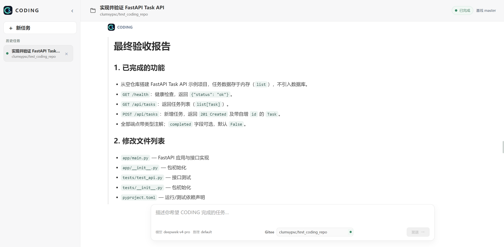
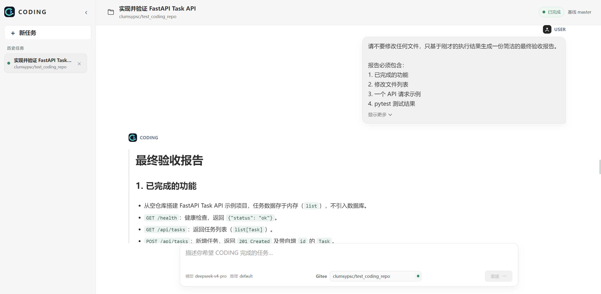
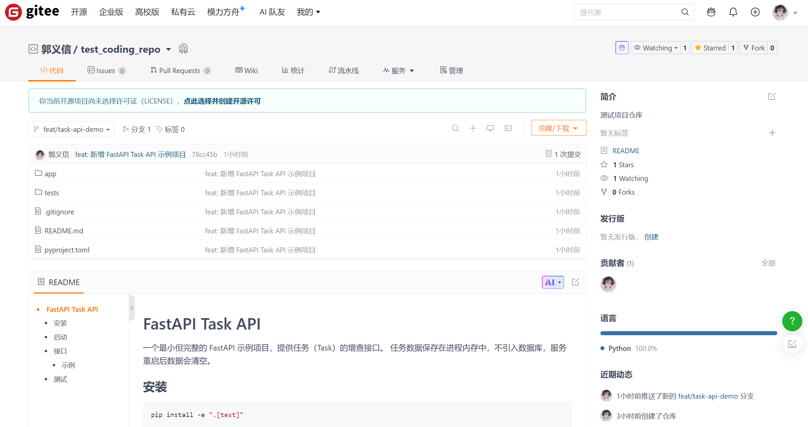

# CODING

# 面向真实代码仓库的 AI Coding Agent

CODING 是一个面向个人开发者的本地优先 AI Coding Agent：连接真实代码仓库，理解任务上下文，规划修改路径，流式汇报执行过程，并把代码交付到可验证的分支与 Pull Request 工作流中。

  
  
  
  
  

> 让 AI 进入真实研发闭环：从仓库上下文，到计划、执行、验证，再到可审阅的交付结果。

## 产品概览

CODING 把「聊天式需求输入」和「工程化代码交付」放在同一个工作台中。它适合以下场景：

- 从 Gitee 仓库开始一个新的功能、修复或重构任务；
- 在执行过程中持续查看计划、工具调用、测试结果和风险提示；
- 对长消息和长输出进行可控阅读，不被流式更新强制拉回底部；
- 在本地保留线程、checkpoint、任务摘要和交付结果；
- 通过 Gitee 分支、提交和 Pull Request 完成后续协作。

## 核心能力

| 能力 | 说明 |
| --- | --- |
| 仓库驱动 | 以 Gitee 仓库为任务入口，保留仓库、分支和交付上下文 |
| Agent 编排 | 基于 DeepAgents 组织上下文、计划、工具调用与结果汇总 |
| 流式会话 | 通过 FastAPI SSE 实时呈现计划、进度、日志和最终回答 |
| 工程验证 | 支持测试、健康检查、敏感文件检查和 Git 状态确认 |
| 交付闭环 | 面向分支、commit、push 与 Pull Request 的研发流程 |
| 本地优先 | SQLite 保存 checkpoint 与业务状态，数据和日志目录可配置 |
| 可阅读 UI | 支持历史会话、会话标题、消息折叠和流式阅读位置保持 |

## 一次任务的完整链路

~~~mermaid
flowchart LR
    U[用户需求] --> W[Vue 工作台]
    W --> API[FastAPI Dashboard API]
    API --> T[Thread / Checkpoint]
    API --> A[DeepAgents Runtime]
    A --> G[Gitee Repository]
    A --> V[Tests / Health / Git Checks]
    G --> D[Branch / Commit / Pull Request]
    V --> R[流式结果与验收报告]
    D --> R
~~~

## 对话式研发体验

会话界面将用户需求与 Agent 输出分离展示；长消息默认收起，用户可以按需展开，避免长提示占满屏幕。

流式输出期间，界面会尊重用户当前的阅读位置：用户向上查看历史内容时，不会因为新内容到达而持续跳回底部；回到底部后再继续跟随最新输出。

## Gitee 交付闭环

CODING 的目标不是只生成一段回答，而是把任务推进到可检查的工程结果：

1. 填写仓库与需求；
2. 获取仓库上下文并生成执行计划；
3. 在隔离工作区中修改和验证；
4. 汇总测试、Git 状态与敏感文件检查；
5. 按策略创建分支、提交、推送或生成 Pull Request。

> 截图展示的是 CODING 的实际工作台与测试仓库交付结果。示例仓库仅用于演示，不代表本项目的默认生产仓库。

## 架构分层

| 层 | 主要职责 |
| --- | --- |
| <code>ui/</code> | Vue 3 前端、历史线程、会话窗口、SSE 流式呈现 |
| <code>agent/server.py</code> | FastAPI 应用入口、Dashboard 路由与流式响应 |
| <code>agent/core/</code> | 设置、运行时、checkpoint、日志和任务编排 |
| <code>agent/backends/</code> | 仓库、Shell、文件和外部服务等后端能力 |
| <code>scripts/</code> | Windows 启动、统一启动、配置检查和验证脚本 |
| <code>data/</code> | SQLite checkpoint 与业务 Store |
| <code>logs/</code> | 后端日志与 Agent 运行日志 |

## 快速开始

### 1. 创建 Python 环境

Windows PowerShell：

~~~powershell
py -3.14 -m venv .venv
.venv/Scripts/python.exe -m pip install --upgrade pip setuptools wheel
.venv/Scripts/python.exe -m pip install -e .
~~~

如果本机没有 Python 3.14，请选择与项目依赖兼容的 Python 版本，并相应调整第一条命令。

### 2. 安装前端依赖

项目使用 Yarn：

~~~powershell
Set-Location ui
yarn install
Set-Location ..
~~~

### 3. 准备配置

~~~powershell
Copy-Item .env.example .env
~~~

然后在 <code>.env</code> 中填写模型和 Gitee 凭据。真实 Token、API Key 和密码只保存在本地，不要提交到 GitHub。

### 4. 启动服务

分别启动：

~~~powershell
./scripts/start_backend.cmd
./scripts/start_ui.cmd
~~~

或统一启动：

~~~powershell
.venv/Scripts/python.exe scripts/start_all.py
~~~

打开前端：

- Web UI：<code>http://127.0.0.1:3000</code>
- 后端健康检查：<code>http://127.0.0.1:2024/health</code>

## 配置参考

正式环境变量统一使用 <code>CODING_*</code> 前缀：

| 变量 | 用途 |
| --- | --- |
| <code>DEEPSEEK_API_KEY</code> | DeepSeek API 凭据 |
| <code>DEEPSEEK_BASE_URL</code> | 模型服务地址 |
| <code>MAIN_MODEL</code> | 主 Agent 使用的模型 |
| <code>GITEE_TOKEN</code> | Gitee API 凭据 |
| <code>CODING_DATA_DIR</code> | SQLite 数据目录 |
| <code>CODING_LOG_DIR</code> | 日志目录 |
| <code>CODING_LOG_LEVEL</code> | 日志级别 |
| <code>CODING_LOG_WHEN</code> | 日志轮转周期 |
| <code>CODING_LOG_INTERVAL</code> | 日志轮转间隔 |
| <code>CODING_LOG_RETENTION_DAYS</code> | 日志保留天数 |
| <code>CODING_BACKEND_HOST</code> / <code>CODING_BACKEND_PORT</code> | 后端监听地址与端口 |
| <code>CODING_UI_HOST</code> / <code>CODING_UI_PORT</code> | 前端监听地址与端口 |
| <code>AI_WORKSPACE_ROOT</code> | Agent 临时工作区根目录 |

完整占位符配置见 [<code>.env.example</code>](.env.example)。

## 数据、工作区与日志

默认情况下，运行时数据位于项目根目录下：

~~~text
data/checkpoints.sqlite   LangGraph checkpoint，保存会话历史与 thread state
data/store.sqlite         业务 Store，保存任务摘要、交付结果与 review findings
logs/backend.log          当前后端日志
logs/agent-runs.log       当前 Agent 运行日志
logs/backend.log.YYYY-MM-DD
logs/agent-runs.log.YYYY-MM-DD
                          跨日轮转后的历史日志
~~~

<code>AI_WORKSPACE_ROOT</code> 用于指定 Agent 的临时工作区。建议为本机独立目录，不要把临时 workspace、日志、数据库或真实配置提交到仓库。

## Dashboard API

前端通过 POST SSE 与后端交互，当前核心接口包括：

~~~text
GET    /dashboard/api/me
GET    /dashboard/api/options
GET    /dashboard/api/threads
GET    /dashboard/api/threads/{thread_id}
POST   /dashboard/api/threads/stream-message
POST   /dashboard/api/threads/{thread_id}/stream-message
DELETE /dashboard/api/threads/{thread_id}
GET    /health
~~~

流式响应会按事件顺序呈现用户消息、任务计划、工具进度、Agent 输出和最终状态。前端不依赖旧版 <code>/api/tasks</code> 后台任务接口。

## Reviewer 能力

Reviewer 相关能力用于读取仓库上下文、执行检查并形成可审阅的结果摘要。接入 Gitee API、分支策略和 Pull Request 时，请优先阅读：

- [Gitee Reviewer API 参考](docs/gitee-reviewer-api-reference.md)
- [Code Reviewer Subagent](docs/CODING_CODE_REVIEWER_SUBAGENT.md)
- [Linux 部署运行手册](docs/CODING_LINUX_DEPLOYMENT_RUNBOOK.md)
- [前端环境配置](docs/CODING_FRONTEND_ENV_SETUP.md)
- [开源 Reviewer 对比资料](docs/reviewer_references/open_source_reviewer_comparison.md)

## 安全边界

提交或发布前，请确认以下内容只存在于本地：

- <code>.env</code>、<code>.env.*</code>、<code>.secrets/</code>；
- <code>.venv/</code>、<code>ui/node_modules/</code>、<code>ui/dist/</code>；
- <code>.codegraph/</code>、<code>logs/</code>、临时 workspace；
- <code>*.sqlite</code>、<code>*.sqlite3</code>、<code>*.db</code>、<code>*.log</code>、<code>*.bak</code>；
- API Key、Token、密码、私钥和证书文件。

<code>.gitignore</code> 已覆盖上述主要运行时与敏感内容；提交前仍应执行 <code>git status --short</code> 和敏感文件检查。

## 验证

基础验证：

~~~powershell
.venv/Scripts/python.exe scripts/verify_backend.py
.venv/Scripts/python.exe -m pytest
~~~

前端构建：

~~~powershell
Set-Location ui
yarn build
Set-Location ..
~~~

真实 Gitee 端到端验证可能调用模型、创建提交或 Pull Request，请只对测试仓库运行，并在执行前确认 Token 权限与目标分支。

## 当前边界

这是面向个人开发者的第一版，当前重点是本地研发闭环，不承诺：

- 多用户身份、团队权限和审计系统；
- 云端沙箱、弹性调度和高可用部署；
- 自动合并 Pull Request；
- 对所有 Git 服务商的统一能力覆盖。

## 后续路线图

- [ ] 更清晰的分支策略与变更预览
- [ ] 更完整的 Reviewer 结果卡片和文件级 diff
- [ ] 可配置的模型、推理模式与工具权限
- [ ] 更完善的任务恢复、重试和失败诊断
- [ ] GitHub / Gitee 之外的仓库连接器
- [ ] 部署向团队协作和云端运行环境演进

## License

本项目采用 [MIT License](LICENSE)。第三方依赖和外部资料仍以其各自许可证、作者声明和来源说明为准。
