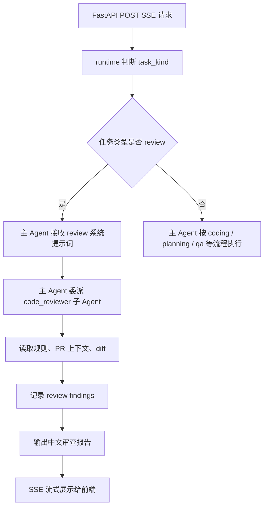
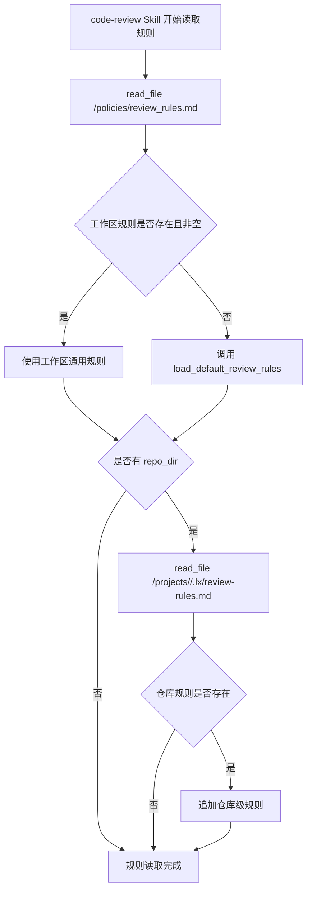
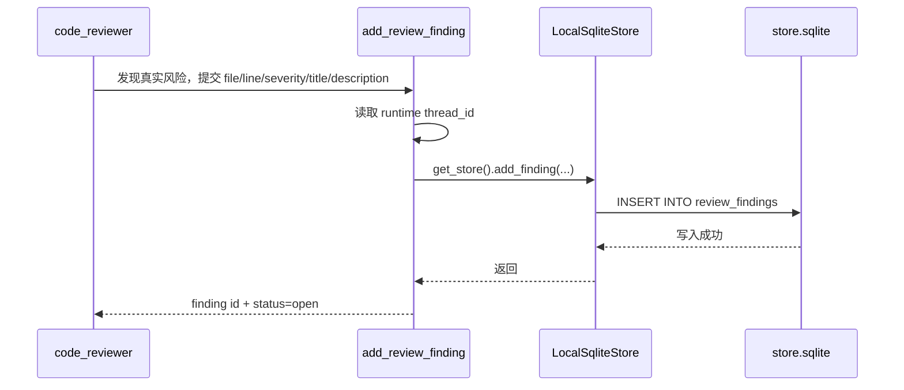
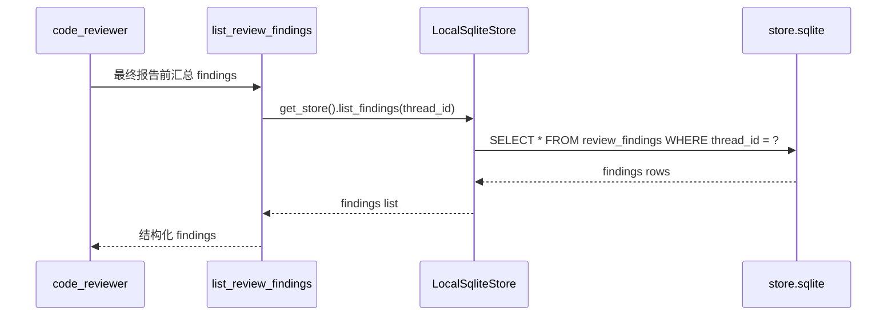
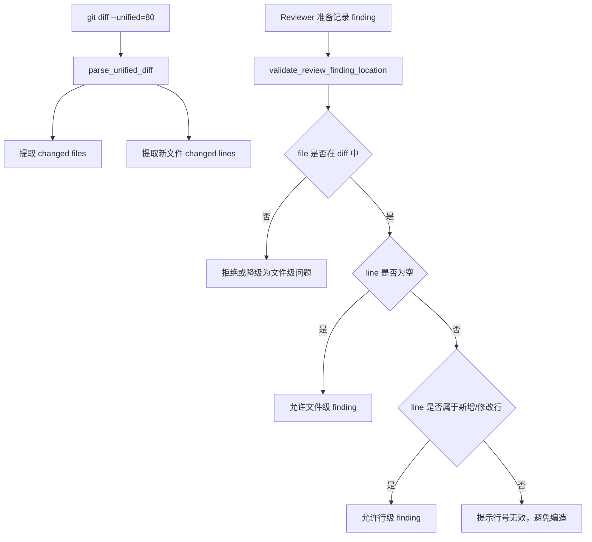
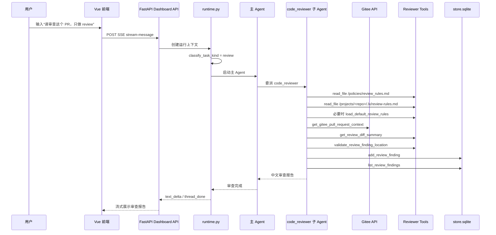
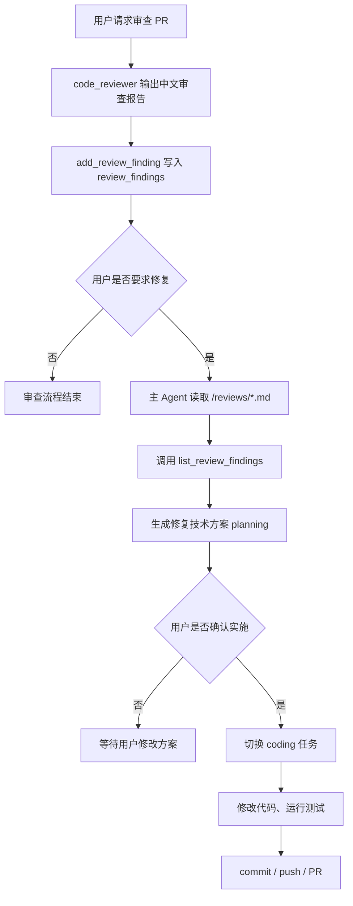
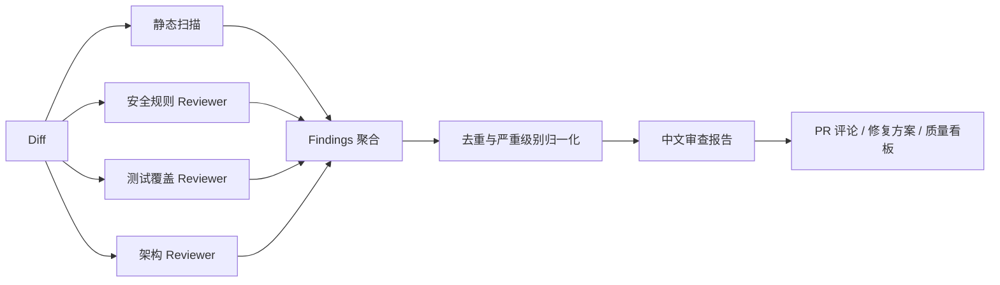

# CODING Reviewer 子 Agent 设计详解

本文专门讲解 CODING 项目中的 `code_reviewer` 子 Agent，包括它为什么存在、如何被主 Agent 调用、有哪些工具、如何读取审查规则、如何记录结构化 findings、如何和前端以及后续修复流程形成闭环。

---

## 1. Reviewer 子 Agent 的定位

`code_reviewer` 是 CODING 中专门负责代码审查的 SubAgent。

它的核心职责不是写代码，而是围绕 Gitee Pull Request 或本地分支 diff 做专业审查：

- 读取 Gitee PR 上下文；
- 读取审查规则；
- 读取本地 diff；
- 识别真实风险；
- 校验 finding 文件和行号；
- 记录结构化 review findings；
- 输出中文审查报告；
- 在用户确认后，可由主 Agent 将审查报告发布到 Gitee PR 评论区。

它和主 Agent 的职责边界如下：

| 角色 | 主要职责 | 是否修改代码 | 是否提交 / push | 是否创建 PR |
|---|---|---:|---:|---:|
| 主 Agent | 需求理解、技术方案、代码实现、测试、提交、PR、修复闭环 | 是 | 是 | 是 |
| `code_reviewer` 子 Agent | PR / diff 审查、记录 findings、输出审查报告 | 否 | 否 | 否 |

这个设计遵循一个原则：

```text
实现代码和审查代码分离
```

也就是说，主 Agent 可以写代码，但代码审查要委派给一个只读的专业子 Agent，避免“自己写、自己审、自己放过”的职责混杂。

---

## 2. 为什么代码审查要使用 SubAgent

在企业级 AI Coding 项目中，代码审查和代码实现是两种不同能力。

如果都由主 Agent 完成，会出现几个问题：

| 问题 | 影响 |
|---|---|
| 职责混杂 | 主 Agent 容易边审查边改代码，违背用户“只 review”的要求 |
| 审查不客观 | 模型容易解释自己刚生成的代码，而不是严格发现风险 |
| 权限过大 | review 阶段本应只读，却可能误触发写文件、commit、push |
| 结果不可复用 | 自然语言报告如果不结构化，后续修复方案难以精确引用 |
| 规则不稳定 | 主 Agent 的开发 prompt 和 reviewer 的审查 prompt 容易互相干扰 |

使用 SubAgent 后，可以把能力拆开：

```text
主 Agent：流程编排、任务分类、用户确认、代码修复
Reviewer 子 Agent：只读审查、风险判断、findings 记录、审查报告
```

这样更符合企业中的角色分工：

```text
开发者 != Reviewer
```

---

## 3. 当前项目中的创建位置

Reviewer 子 Agent 在 `agent/server.py` 中由 `_code_reviewer_subagent(model)` 创建。

它被注册到主 Agent 的 `subagents` 参数中：

```python
subagents=[
    _general_purpose_subagent(subagent_model),
    _code_reviewer_subagent(subagent_model),
]
```

主 Agent 在创建时同时获得：

- 主模型 `main_model`；
- 子 Agent 模型 `subagent_model`；
- 主工具列表；
- 子 Agent 定义；
- backend；
- permissions；
- middleware；
- skills；
- checkpointer；
- store。

整体关系如下：



---

## 4. Reviewer 子 Agent 的系统提示词

`code_reviewer` 的系统提示词强调四个边界。

| 边界 | 说明 |
|---|---|
| 只做 review | 不负责修改代码 |
| 中文输出 | 面向用户的自然语言必须使用中文 |
| 只记录真实风险 | 不记录纯风格偏好 |
| finding 结构化 | 问题必须包含文件、行号、级别、标题、描述 |

它的核心流程是：

1. 按 `code-review` skill 读取审查规则；
2. 如果用户提供 Gitee PR，读取 PR 详情、提交、文件、评论；
3. 获取本地 diff 摘要和变更行号；
4. 只记录会导致真实风险的问题；
5. 校验 finding 位置；
6. 使用 `add_review_finding` 保存结构化问题；
7. 使用 `list_review_findings` 汇总；
8. 输出中文审查报告；
9. 不修改文件、不提交、不 push、不创建 Pull Request。

---

## 5. Reviewer 子 Agent 的权限设计

Reviewer 子 Agent 的权限比主 Agent 更窄。

它可以读取项目、规则、记忆和临时文件；可以写审查报告；但不能修改业务源码。

| 路径 | read | write | 说明 |
|---|---:|---:|---|
| `/projects/**` | 是 | 否 | 可以审查源码，但不能修改源码 |
| `/skills/**` | 是 | 否 | 可以读取 skill 方法论 |
| `/policies/**` | 是 | 否 | 可以读取工作区审查规则 |
| `/reviews/**` | 是 | 是 | 可以读取或保存审查报告 |
| `/memories/**` | 是 | 否 | 可以读取仓库长期记忆 |
| `/tmp/**` | 是 | 是 | 可以写临时审查材料 |
| `/**` | 默认拒绝 | 默认拒绝 | 禁止越权访问其他路径 |

权限设计的重点是：

```text
Reviewer 可以看代码，但不能改代码。
```

这可以保证用户输入“只做代码 review，不要修改代码”时，后端权限也能配合约束，而不是只依赖 Prompt。

---

## 6. Reviewer 子 Agent 使用的 Skill

Reviewer 子 Agent 挂载了：

```text
/skills/
```

其中与代码审查直接相关的是：

```text
/skills/code-review/SKILL.md
```

该 skill 定义了审查方法论，包括：

- 角色定位；
- 输出语言；
- 审查输入；
- 规则读取顺序；
- PR 上下文读取；
- diff 读取；
- finding 记录；
- 行号校验；
- 审查报告格式；
- 禁止事项。

### 6.1 规则读取顺序

当前项目已经把规则读取职责放回 skill，而不是让工具内部私自创建 backend。

读取顺序如下：

| 顺序 | 位置 | 说明 |
|---:|---|---|
| 1 | `/policies/review_rules.md` | 工作区通用审查规则 |
| 2 | `/projects/<repo>/.lx/review-rules.md` | 仓库级补充审查规则 |
| 3 | `load_default_review_rules` | 项目内置默认规则兜底 |

Mermaid 表示：



这样做的好处是：

| 设计点 | 好处 |
|---|---|
| skill 编排规则读取 | 更符合 DeepAgents skills 的职责 |
| 工具只做默认规则兜底 | 不再绕过统一 backend |
| 工作区规则优先 | 方便项目或团队统一配置审查规范 |
| 仓库规则追加 | 支持不同仓库的特殊约束 |

---

## 7. Reviewer 子 Agent 的工具清单

Reviewer 子 Agent 单独挂载了如下工具。

| 工具 | 来源文件 | 作用 |
|---|---|---|
| `get_gitee_pull_request_context` | `agent/tools/gitee_tools.py` | 读取 Gitee PR 标题、描述、提交、变更文件、评论 |
| `load_default_review_rules` | `agent/tools/reviewer_tools.py` | 读取项目内置默认审查规则 |
| `get_review_diff_summary` | `agent/tools/reviewer_tools.py` | 获取本地 diff 摘要和变更行号 |
| `validate_review_finding_location` | `agent/tools/reviewer_tools.py` | 校验 finding 是否落在真实 diff 文件和变更行 |
| `add_review_finding` | `agent/tools/reviewer_tools.py` | 把审查发现写入业务 Store |
| `list_review_findings` | `agent/tools/reviewer_tools.py` | 汇总当前 thread 的审查发现 |

### 7.1 为什么工具数量不多

Reviewer 子 Agent 不需要主 Agent 的全部工具。

它不需要：

- `open_gitee_pull_request`；
- `publish_gitee_pr_comment`；
- `web_search`；
- `fetch_url`；
- 写代码相关能力；
- Git push 相关能力。

原因是 Reviewer 的职责是只读审查。如果给它过多工具，会扩大权限和行为不确定性。

---

## 8. Review findings 存在哪里

Reviewer 子 Agent 发现的问题会通过 `add_review_finding` 写入业务 Store。

数据库位置：

```text
B:\my_project\CODING\data\store.sqlite
```

表名：

```text
review_findings
```

表字段包括：

| 字段 | 说明 |
|---|---|
| `id` | finding id，例如 `finding-xxxx` |
| `thread_id` | 所属会话 / 任务 |
| `file` | 问题文件 |
| `line` | 问题行号，可为空 |
| `severity` | 严重级别 |
| `title` | 问题标题 |
| `description` | 风险说明和建议 |
| `status` | 状态，默认 `open` |
| `created_at` | 创建时间 |
| `updated_at` | 更新时间 |

写入链路：



读取链路：



注意：

```text
review findings 属于业务 Store，不属于 checkpoint。
```

checkpoint 保存的是 Agent 会话状态和消息历史；Store 保存的是结构化业务数据。

---

## 9. Diff 摘要和行号校验

Reviewer 不能只依赖模型从 diff 文本里猜行号。

LLM 常见问题包括：

- 编造不存在的文件；
- 把旧文件行号当成新文件行号；
- 对长 diff 出现行号漂移；
- 把删除行当成可评论的新文件行；
- 找不到具体变更行时硬编一个行号。

所以项目中有 `agent/reviewer_diff.py`，用确定性代码解析 unified diff。

核心数据结构：

| 结构 | 作用 |
|---|---|
| `DiffFile` | 单个变更文件及其新增 / 修改行号 |
| `DiffSummary` | 整个 diff 的 base、head、files、raw_diff |
| `parse_unified_diff` | 解析 diff 文本 |
| `validate_finding_location` | 校验 finding 是否在真实变更行上 |

行号校验流程：



---

## 10. Reviewer 子 Agent 的完整运行流程

下面是一次典型 Gitee PR 审查流程。



---

## 11. 和前端 SSE 的关系

Reviewer 子 Agent 的输出仍然走项目统一的流式输出链路。

也就是说，它不会单独开一个前端协议，而是复用主项目的 POST SSE。

前端主要看到：

| 事件 | 内容 |
|---|---|
| `user_message` | 用户输入的审查指令 |
| `todo_delta` | Reviewer 执行中的任务计划 |
| `text_delta` | 审查过程中的中文分析和最终报告 |
| `thread_done` | 本轮任务结束 |
| `error` | 审查失败原因 |

对于用户来说，代码审查和普通 coding 任务的交互方式一致：

```text
输入指令 -> 查看任务计划 -> 查看流式输出 -> 获取最终报告
```

区别只是后端 task_kind 是 `review`，并委派了 `code_reviewer` 子 Agent。

---

## 12. 和后续修复闭环的关系

Reviewer 子 Agent 本身不改代码。

但是它的审查结果可以驱动后续修复。

闭环流程如下：



这里有一个关键边界：

```text
Reviewer 负责发现问题。
主 Agent 负责修复问题。
```

这样可以保证审查过程本身稳定、只读、可追踪。

---

## 13. 当前 Reviewer 设计的优点

| 优点 | 说明 |
|---|---|
| 职责清晰 | 审查和实现分离 |
| 权限安全 | reviewer 不能修改 `/projects` |
| Gitee 适配 | 第一版专注 Gitee PR，不考虑 GitHub 等平台 |
| 规则可扩展 | 支持工作区规则、仓库规则、默认规则 |
| findings 结构化 | 可以被后续修复方案读取 |
| 行号可校验 | 减少模型编造文件和行号 |
| 前端一致 | 复用统一 SSE 和任务计划展示 |
| 适合开发 | 可以清楚讲解 SubAgent、工具、skill、Store、权限边界 |

---

## 14. 当前设计的限制

第一版 reviewer 子 Agent 仍然有一些边界。

| 限制 | 说明 |
|---|---|
| 只支持 Gitee | 当前不考虑 GitHub、GitLab 等平台 |
| 不自动发布评论 | 发布到 Gitee PR 评论前必须用户确认 |
| findings 只绑定 thread | 如果跨会话复用 findings，需要额外索引 |
| diff preview 有截断 | 超长 diff 需要读取具体文件继续审查 |
| 不运行完整安全扫描器 | 当前主要是规则 + diff + LLM 审查 |
| 不做自动修复 | 修复必须交回主 Agent，并经过用户确认 |

这些限制是有意保留的。第一版重点是稳定、可讲、可控，而不是一次性做成完整 DevSecOps 平台。

---

## 15. 后续可扩展方向

后续可以围绕 reviewer 子 Agent 继续扩展。

| 方向 | 说明 |
|---|---|
| PR 评论发布策略 | 支持只发布 high 以上问题，或按文件分组发布 |
| 审查规则版本化 | 给 `/policies/review_rules.md` 增加版本号和变更记录 |
| findings 状态流转 | 支持 open、fixed、ignored、false_positive |
| 二次审查 | 修复后再次审查同一个 PR，对比旧 findings |
| 静态扫描集成 | 接入 ruff、bandit、eslint、semgrep 等工具 |
| 测试覆盖分析 | 自动识别变更文件是否有对应测试 |
| Reviewer 多角色 | 安全 reviewer、测试 reviewer、架构 reviewer 分别审查 |
| Gitee 评论同步 | 将结构化 findings 映射为 Gitee 评论 |
| 审查质量评估 | 对 reviewer 的漏报、误报进行人工标注和评估 |

一个更复杂的企业版 reviewer 体系可以演进为：



---

## 16. 开发验证讲解建议

如果把 reviewer 子 Agent 作为项目部分讲解，可以按下面顺序展开。

| 顺序 | 讲解内容 | 对应文件 |
|---:|---|---|
| 1 | 为什么要拆 reviewer 子 Agent | `agent/server.py` |
| 2 | `_code_reviewer_subagent` 如何定义 | `agent/server.py` |
| 3 | reviewer 的权限为什么只读 | `agent/server.py` |
| 4 | `code-review` skill 如何约束流程 | `agent/skills/code-review/SKILL.md` |
| 5 | 审查规则如何读取 | `/policies/review_rules.md`、`.lx/review-rules.md`、`load_default_review_rules` |
| 6 | Gitee PR 上下文如何读取 | `agent/tools/gitee_tools.py` |
| 7 | diff 如何解析和校验行号 | `agent/reviewer_diff.py` |
| 8 | findings 如何结构化保存 | `agent/tools/reviewer_tools.py`、`agent/store/sqlite_store.py` |
| 9 | 前端如何展示审查报告 | `agent/core/streaming_runtime.py`、`ui/src` |
| 10 | 如何进入后续修复闭环 | `agent/core/runtime.py` |

---

## 17. 一句话总结

`code_reviewer` 子 Agent 是 CODING 中专门负责 Gitee PR / diff 审查的只读智能体。

它通过 `code-review` skill 固定审查流程，通过 reviewer tools 读取 PR、diff 和规则，通过 `review_findings` 表结构化沉淀问题，最后输出中文审查报告，并为后续“审查报告 -> 修复方案 -> 用户确认 -> 代码修复”闭环提供可靠输入。
