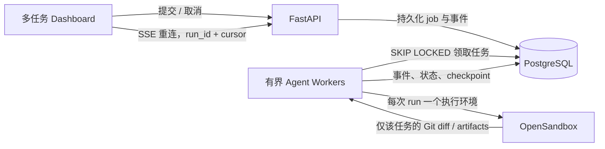

# 多任务并行 Harness 实施方案

日期：2026-09-27

## 目标

在现有 CODING 项目中实现单用户、单机可用的 Codex 式任务管理：用户可以同时提交多个独立任务、在任务间切换，任务在后台继续运行；刷新或短暂断线后能恢复状态和输出；一个任务的文件修改不影响另一个任务。

第一阶段以现有 PostgreSQL 和 node2 上的 OpenSandbox 为基础，不额外引入 Redis。队列、运行状态与可续接事件先由 PostgreSQL 承担。运行并发受显式配置限制；以后多 API/Worker 主机或更高吞吐量时，再将队列和事件总线迁移至 Redis Streams 或专用队列。

## 当前基线

- Dashboard 每个 POST SSE 请求启动一个 API 进程内线程；SSE 通过进程内队列消费。
- UI 只有一份当前会话和 streaming 状态；切换会话会 abort 请求。
- 多会话虽有不同 Git 分支名，但使用同一个仓库检出目录，不能安全并行写。
- 已有业务 PostgreSQL Store、LangGraph PostgreSQL checkpointer、run 事件、worker lease 和 stale-run recovery 原语；lease 当前只标识 run 所属 worker，没有队列调度、全局并发限额或仓库隔离作用。
- 普通 Agent 运行当前绑定 LocalShellBackend；OpenSandbox 适配器仅用于 Eval。

## 目标结构

## 实施阶段

### 1. 持久任务与事件数据层

- 为 run 增加可排队输入、领取/租约、取消请求和 attempt 元数据；保留旧 runs 行并使用增量 schema migration。
- 增加按 run 单调排序的 `run_stream_events`，保存全部前端事件 payload，使 SSE 可从 cursor 重放。
- 为 PostgreSQL 实现原子 `claim_next_run`（短事务、`FOR UPDATE SKIP LOCKED`）；为 SQLite 提供测试及本地开发实现。
- 在线程内保持顺序：同一 thread 仅允许运行一个 Agent turn；不同 thread 可并行。

### 2. 有界 Worker 与恢复

- POST 请求只创建 thread/run、写入 prompt 和 queued 状态，不在 API handler 中跑 Agent。
- Worker 数由 `AGENT_MAX_CONCURRENT_RUNS` 控制；worker 领取任务后更新心跳，完成、失败、取消均写终态。
- 进程重启时保留 queued 任务；过期 running lease 标记为 interrupted，由用户显式重试，避免重复执行已有外部副作用。
- 取消采用协作式信号，在 Agent event/tool 边界检查；queued 任务可立即取消，运行中任务发出取消请求并尽快收敛。

### 3. 每任务隔离工作区与 OpenSandbox

- 为 thread 建立稳定独立 checkout；同一 thread 的连续轮次复用 checkout，不同 thread 永不共享可写目录。
- 每个 run 建立独立 OpenSandbox，上传当前 thread checkout 和必要的只读 skills/policies；所有 Agent 文件与命令工具都绑定该沙箱。
- run 结束时导出二进制 diff，在 host 侧对应 thread checkout 内校验并应用；保留可审阅的分支/patch。禁止沙箱访问其他任务目录和宿主凭证。
- 沙箱创建失败时任务失败并清理，不静默退回宿主机执行。

### 4. API 与多任务 UI

- 保留现有提交入口，增加 run status、按 cursor 续接 SSE、取消 run 的 API。
- Pinia 状态按 `thread_id`/`run_id` 保存；切换会话只切换视图，不 abort 后台任务。
- 左侧任务列表展示排队/运行/等待用户/完成/失败状态；增加活跃任务条，方便一键切回任务。
- 首次加载时读取活跃 runs 并重连 SSE；终态仍可从 thread 历史和 run 事件恢复。
- 每个 thread 的输入可独立忙碌/取消；新建任务不受其他 thread 正在运行的影响。

组件边界：`AgentWorkspace.vue` 继续负责当前会话布局与输入；新增 `ActiveTaskStrip.vue` 只展示活跃 thread 并发出 select 事件；`SessionSidebar.vue` 继续展示全量 thread 与状态，允许运行中切换和新建；Pinia store 按 thread/run 保存消息、游标、控制器与状态。

### 5. 验收与风险收敛

- SQLite 单测覆盖 schema 兼容、并发领取互斥、run 排序、事件游标重放、取消、lease 恢复和独立任务工作区。
- node2 PostgreSQL 集成测试使用唯一测试前缀并在结束后删除本轮创建的测试行，不清库、不删现有表。
- node2 OpenSandbox E2E 创建临时沙箱，验证上传、文件读写、命令执行、diff 回传和资源销毁。
- 模拟两个不同 thread 同时运行，确认两边可并行、事件互不串流、文件不互相可见；同一 thread 并发提交应被串行或明确拒绝。
- 前端执行 Vite production build；后端执行相关单测和真实依赖集成验证。

## 当前实施结果

- 已实现 PostgreSQL/SQLite 持久队列、有界 worker、跨 API 进程全局并发准入、同 thread 单运行、协作取消、心跳和事件游标重放。
- queued run 在重启后保留；lease 过期的 running run 变成 `interrupted`，等待用户显式重试，避免副作用任务自动重放。
- Dashboard 支持任务间切换、活跃任务条、取消、后台持续运行和按 SSE cursor 恢复；仓库 clone 路径按 thread 隔离。
- 已实现可选 `CODING_AGENT_RUNTIME_BACKEND=opensandbox`：每 run 建沙箱，只上传该 thread checkout 与 skills/policies，导出并校验 patch，再销毁沙箱。运行时默认保持 `local`，因为 node2 当前默认镜像缺 Node/npm，尝试使用公开 Python+Node 镜像时被该 OpenSandbox 服务的镜像 allowlist 拒绝；apt 安装在沙箱命令限时内未完成。Python 仓库可单独启用；全栈运行需 node2 管理员将可信的 Python+Node 镜像加入 allowlist，并配置 `OPEN_SANDBOX_IMAGE` 后再启用。
- node2 OpenSandbox 默认镜像下已验证 sandbox 创建、上传、Python/Git 命令、tracked/untracked patch 导出和销毁；真实 PostgreSQL queue 集成测试结束后删除了所有 probe 行。
- 回归结果：`tests/unit` 149 项通过；队列/SSE 专项共 7 项通过；`npm run build` 通过。真实 PostgreSQL 队列生命周期通过并清理 probe 行。外部模型服务上的完整 Agent 任务未在回归中自动触发，以免产生真实模型计费或远端 Git/PR 副作用。

## 可借鉴实现

- [Codex app：并行 threads 与隔离 worktrees](https://openai.com/index/introducing-the-codex-app/)；[Codex 长任务：外化状态、计划、观察与修复循环](https://developers.openai.com/blog/run-long-horizon-tasks-with-codex)。
- [OpenHands Runtime architecture](https://github.com/OpenHands/docs/blob/main/openhands/usage/architecture/runtime.mdx)：每个 session 使用隔离 runtime；[Agent Server architecture](https://github.com/OpenHands/docs/blob/main/sdk/arch/agent-server.mdx)：应用服务与执行 runtime 分层。
- [PostgreSQL SELECT / `SKIP LOCKED`](https://www.postgresql.org/docs/current/sql-select.html)：适合多个消费者领取队列行；领取事务保持短，不持有长任务锁。
- [PGMQ](https://github.com/pgmq/pgmq)：提供 visibility timeout、ack/archive 等成熟队列概念；当前 node2 未预设 PGMQ extension，因此第一阶段直接使用现有 PostgreSQL 表与 lease，避免引入扩展依赖。
- 全栈沙箱镜像参考：[Microsoft Dev Containers JavaScript/Node image](https://github.com/devcontainers/images/blob/main/src/javascript-node/README.md)；[Python + Node image project](https://github.com/nikolaik/docker-python-nodejs)。部署时使用经审查、固定 tag/digest 且已纳入 OpenSandbox allowlist 的镜像。

## 设计约束

- 不复用或清空 node2 现有数据库；迁移只做兼容性增列/建表。
- OpenSandbox 可以按配置成为 Agent 执行路径；健康检查成功不等于容量测试通过，镜像能力也必须匹配项目技术栈。
- 工作区隔离是正确性的先决条件，不能以 UI 多开窗口替代。
- 重启恢复不重复提交相同 thread 的 LangGraph turn；只有未开始或明确可重试的任务可以重排。
